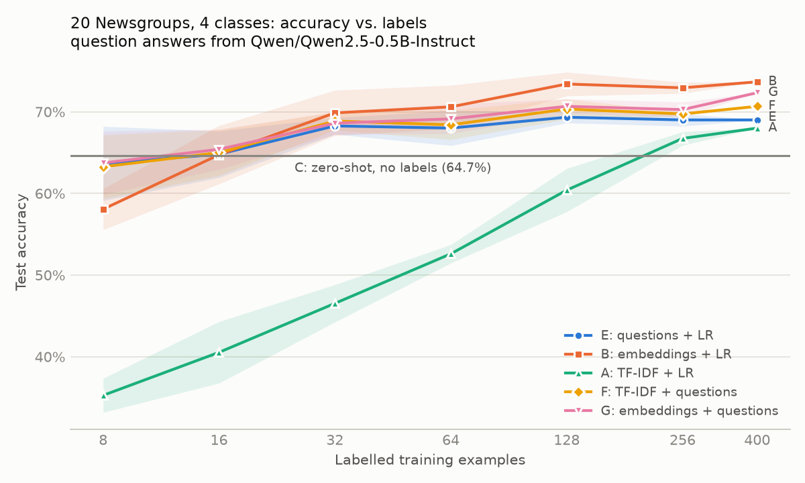

# Results: Qwen2.5-0.5B-Instruct on CPU (September 2026)

The first end-to-end run of the plan in [docs/design.md](../docs/design.md), made with the local
`TransformersModel` backend. **This is a floor, not the headline.** The model is a 0.5B-parameter
instruct model running in float32 on a 4-core laptop CPU (Intel N100, no GPU); the design targets
Gemma 4 12B/31B or Jev. What it does show is the harness working end to end, where the method helps
and where it doesn't at this model size, and one real bug that the behaviour checks caught.

| | |
|---|---|
| Model | `Qwen/Qwen2.5-0.5B-Instruct@7ae55760`, float32, `max_state_tokens=160` |
| Data | 20 Newsgroups, 4 classes (alt.atheism, comp.graphics, sci.space, talk.religion.misc); headers, footers and quotes removed; 400 train / 300 test, stratified |
| Question bank | 13 noul questions + 1 four-way choice ([data.py](data.py)), written to the rules in design §3 |
| Cost | 9,800 answers, 486k input tokens, 3.9 h on CPU (≈20 s per post); $0 |
| Reproduce | `python benchmarks/learning_curves.py --model hf:Qwen/Qwen2.5-0.5B-Instruct --n-train 400 --n-test 300 --max-state-tokens 160`. With the committed answer cache it re-fits in about two minutes on the same CPU, with no model calls and identical numbers (verified). |

## Learning curves (Phase 4)

Test accuracy (mean ± std over 5 label draws; one draw at n = 400):

| Arm | n=8 | n=16 | n=32 | n=64 | n=128 | n=256 | n=400 |
|---|---:|---:|---:|---:|---:|---:|---:|
| E: questions + LR | **0.637** ± 0.045 | 0.648 ± 0.028 | 0.683 ± 0.010 | 0.680 ± 0.021 | 0.693 ± 0.007 | 0.690 ± 0.008 | 0.690 |
| B: embeddings + LR | 0.581 ± 0.025 | 0.647 ± 0.036 | **0.699** ± 0.028 | **0.706** ± 0.026 | **0.734** ± 0.015 | **0.729** ± 0.007 | **0.737** |
| A: TF-IDF + LR | 0.353 ± 0.021 | 0.405 ± 0.038 | 0.465 ± 0.023 | 0.526 ± 0.011 | 0.604 ± 0.026 | 0.667 ± 0.008 | 0.680 |
| F: TF-IDF + questions | 0.633 ± 0.039 | 0.650 ± 0.028 | 0.689 ± 0.011 | 0.684 ± 0.018 | 0.703 ± 0.012 | 0.697 ± 0.002 | 0.707 |
| G: embeddings + questions | **0.637** ± 0.039 | **0.654** ± 0.025 | 0.686 ± 0.014 | 0.691 ± 0.018 | 0.707 ± 0.009 | 0.703 ± 0.009 | 0.723 |
| C: zero-shot (no labels) | 0.647 | 0.647 | 0.647 | 0.647 | 0.647 | 0.647 | 0.647 |

All metrics at n = 400:

| Arm | Accuracy | Macro-F1 | Log-loss | ECE |
|---|---:|---:|---:|---:|
| A: TF-IDF + LR | 0.680 | 0.680 | 1.098 | 0.316 |
| B: embeddings + LR | **0.737** | **0.733** | 0.664 | 0.122 |
| C: zero-shot | 0.647 | 0.605 | 1.353 | 0.211 |
| E: questions + LR | 0.690 | 0.686 | 0.678 | 0.089 |
| F: TF-IDF + questions | 0.707 | 0.703 | 0.662 | 0.087 |
| G: embeddings + questions | 0.723 | 0.721 | **0.636** | **0.076** |

**What this says:**

1. **Question features carry the zero-shot prior into the low-label regime.** With 8 labels, questions
   (63.7%) beat embeddings (58.1%) by 5.6 points and TF-IDF (35.3%) by 28. But the zero-shot topic question
   alone scores 64.7% with no labels at all, so at n ≤ 16 the supervised head adds nothing over it yet.
2. **From 32 labels on, MiniLM embeddings win on accuracy.** Question features plateau around 69%: 14
   answers from a 0.5B model are a narrow bottleneck. The design doc's ship criterion (question features
   beat embeddings at ≤ 1k labels) is **not met with this model**.
3. **Adding questions improves probabilities even where it doesn't improve accuracy.** Embeddings +
   questions (G) has the best log-loss (0.636) and ECE (0.076) of any arm. Questions + TF-IDF (F) beats
   TF-IDF alone at every label count.
4. **What would change the picture** is a stronger answering model (Gemma 4 12B/31B, or Jev), a larger
   bank pruned with `grouped_permutation_importance` (Phase 3), and the choice-codebook encoder (arm D),
   which was too slow to run on this CPU.

## Behaviour checks (Phase 1)

48 training posts (12 for noise and injection). Test rows were never used.

| Check | Result | Verdict | What it means for this model |
|---|---|---|---|
| Saturation | 63% of noul answers graded (0.02 < p < 0.98); 444 of 624 below 0.1 | pass, skewed | Answers lean hard toward "No". Use log-odds and standardize (the benchmark does), never raw probabilities with a 0.5 threshold. |
| Noise floor | identical requests → max difference 0.0 | pass | The logit readout is deterministic, as designed. |
| Option order | accuracy 67–71% in every one of 4 rotations, but the top option agrees across all 4 on only 48% of rows; option A gets 8 points less probability than average | fail | Mild position bias. Zero-shot accuracy survives it, but row-level answers don't. Averaging over rotations would help (a candidate `TransformersModel` option). |
| IIA | removing one option shifts the others' log-ratios by a median of 1.21 (p90 3.60) | fail | Don't use `ChoiceEncoder(stitch=True)` or `self_match="renormalize"` with this model: both assume IIA. Removing an option also re-letters the options after it, which interacts with the position bias. |
| Rewording | median Spearman 0.95 between two wordings of 5 questions (min 0.95) | pass | Features measure the text, not the phrasing. |
| Injection | worst attack flips 3.2% of yes/no answers vs. 2.6% for a neutral sentence; "this text is about space travel" changed the topic for 8% of rows | pass (small sample) | Little sensitivity on 12 rows; redo at scale before trusting user-generated text. |
| Coupling | n/a | | Each question is its own prompt, so answers can't depend on the rest of the bank. |

### The bug the order check found

The first run of the order check reported 0% agreement and accuracy collapsing from 71% to 2% under
rotation. That was a package bug, not the model: the question part of the cache key was canonical
JSON with **sorted keys**, so a choice question's options were sorted away and every ordering shared
one cache entry. Answers are stored by position, so a reordered question received another ordering's
probabilities attached to the wrong options. It affected every backend, Jev included. It is fixed
(`question_key` keeps option order), and a regression test fails on the old key.

The learning curves were not affected: every choice answer they use was computed in alphabetical
order, which the bank and `ChoiceClassifier` both use. They were re-keyed in the committed cache and
verified as cache hits. The order check above is the corrected rerun.

## Next runs

- **Gemma 4 12B-it** (the Cygnet recipe) on a 48 GB GPU, and **31B** on 80 GB: same scripts, `--model hf:google/gemma-4-12b-it`.
- **Jev** once an API key is available: `--model jev-1.13`; this also runs the coupling check.
- **decider-4b v2** through a wire-format generalization of `JevModel`.
- **Arm D** (`ChoiceEncoder` exemplar codebook) and the Phase 3 question-bank loop, which need GPU throughput.
